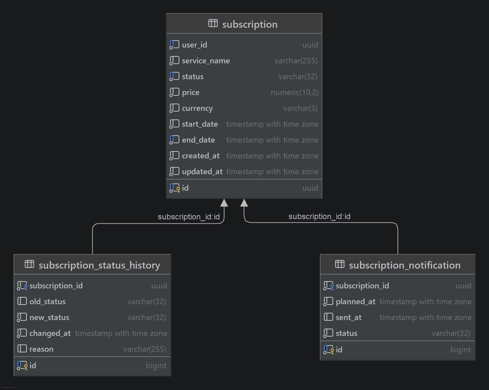

# 🔔 Subscription Tracking App
Приложение хранит информацию о подписках пользователей на различные сервисы. Позволяет управлять жизненным циклом подписок (активация, заморозка, отмена) и автоматически переводить просроченные подписки в архивный статус с помощью фоновых задач.

---

## 🚀 Основной функционал

* ✨ **Управление подписками** — создание, просмотр, отмена (`CANCELED`), приостановка (`SUSPENDED`) и возобновление (`ACTIVE`).
* 🔍 **Умные фильтры** — динамический поиск по любому набору полей (`userId`, `serviceName`, даты действия) с поддержкой пагинации на базе `JpaSpecificationExecutor`.
* ⏱️ **Автоматический контроль лимитов** — фоновый шедулер каждые 15 минут проверяет и переводит истекшие по дате подписки в статус `EXPIRED`.
* 📊 **Архитектура тестирования** — 100% изоляция тестов веб-слоя с помощью `MockitoBean` и интеграционное тестирование базы данных в реальном `PostgreSQL 17` через `Testcontainers`.

---

## 🛠️ Стек технологий

* **Язык:** Kotlin 2.3.21
* **Фреймворк:** Spring Boot 3.5.14 (Web, Data JPA, Validation)
* **База данных:** PostgreSQL 17.5
* **Окружение:** Alpine 3.22.4, OpenJDK 25, Git
* **Тестирование:** JUnit 5, MockMvc, Spring Test, Testcontainers (PostgreSQL)
* **Документация:** Springdoc OpenAPI / Swagger v2.8.17

---

## 💾 Схема базы данных

Сущности управляются в СУБД со следующей структурой таблиц:


---

## 🗺️ API Эндпоинты (REST)

Все запросы по умолчанию используют префикс `/api/v1/subscriptions`.


| Метод | Эндпоинт | Описание | Статус ответа    |
| :--- | :--- | :--- |:-----------------|
| `POST` | `/` | Создание новой подписки | `201 Created`    |
| `GET` | `/` | Список подписок (Фильтры + Пагинация) | `200 OK`         |
| `GET` | `/{id}` | Получение подписки по ID | `200 OK` / `404` |
| `PATCH` | `/{id}/cancel` | Отмена активной подписки | `204 No Content` |
| `PATCH` | `/{id}/suspend` | Приостановка (заморозка) подписки | `204 No Content` |
| `PATCH` | `/{id}/resume` | Возобновление замороженной подписки | `204 No Content` |

> 📖 **Интерактивная документация:** После запуска приложения спецификация Swagger UI доступна по адресу `http://localhost:8080/swagger-ui.html`.

---

## ✍️ Правила изменения статусов (Finite State Machine)

Внутри бизнес-логики приложения жестко разграничены переходы состояний сущности:
1. **Отмена (`cancel`)** — переводит в `CANCELED`. Недоступна для уже истекших подписок (`EXPIRED`).
2. **Заморозка (`suspend`)** — переводит в `SUSPENDED`. Возможна *только* для подписок в статусе `ACTIVE`.
3. **Возобновление (`resume`)** — возвращает в `ACTIVE`. Возможна *только* из статуса `SUSPENDED`. Если `endDate` подписки уже прошел, система выбросит исключение.

---

## ⚙️ Запуск локального окружения

### Способ 1: Полный запуск инфраструктуры в Docker (Рекомендуемый)
1. Создайте в корневой директории проекта текстовый файл `secrets.txt` и впишите туда пароль для базы данных.
2. Запустите сборку и старт всех контейнеров одной командой:
   ```bash
   docker compose up --build -d
   ```
   *Docker Compose соберет приложение из исходников, поднимет БД на порту 5433, применит секреты и запустит сервис на порту 8080.*

### Способ 2: Запуск тестов
Для прогона всей экосистемы тестов (включая веб-контроллеры с `@MockitoBean` и интеграционные тесты репозиториев с автоматическим откатом транзакций `@Transactional`):
```bash
./gradlew clean test
```
